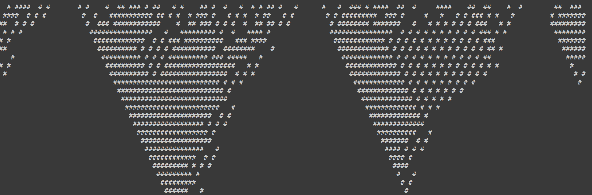
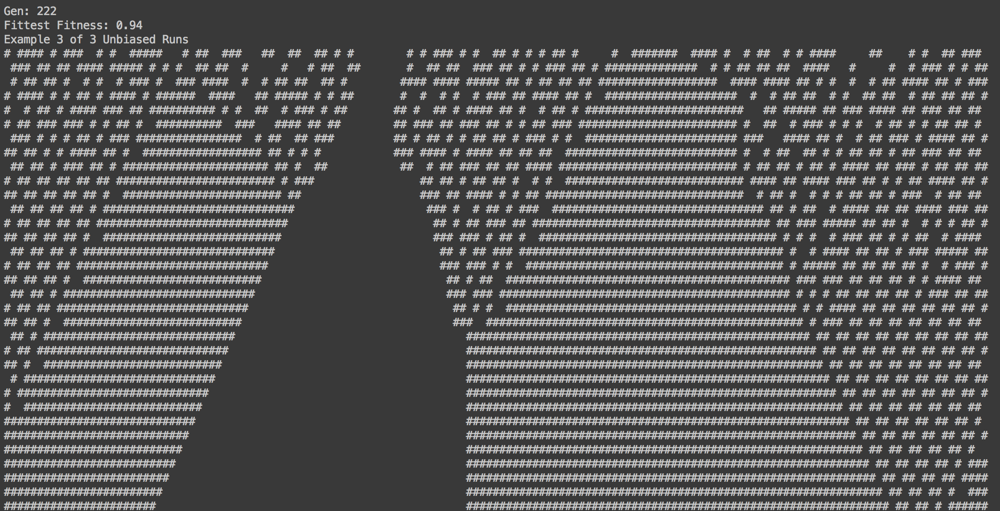
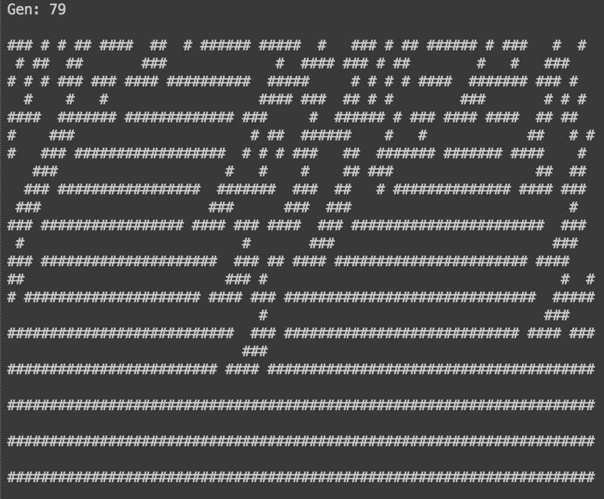
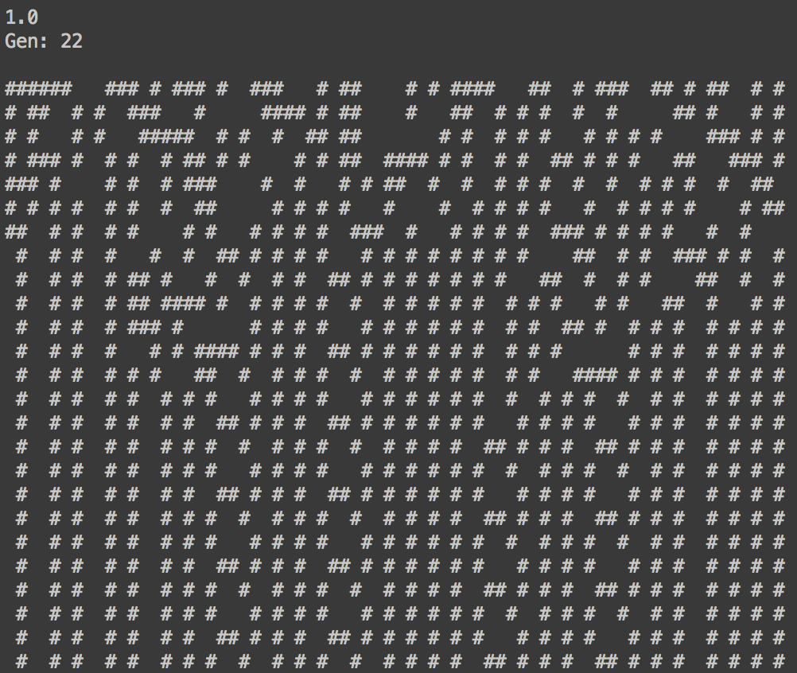

# caga
For [Intro to Complexity](http://www.complexityexplorer.org/online-courses/27-introduction-to-complexity-summer-2015) (a great free course taught by Dr. Melanie Mitchell) homework, working with the ideas presented in [this paper](http://web.cecs.pdx.edu/~mm/evca-review.pdf).

##Majority Rule

Block Expanding (evolved most every time, low to mid 90% F100 against uniform distribution)

Particle behavior? Never saw it as cleanly as demonstrated in Dr. Mitchell's paper.

##Synchronization

Specific 2-point attractor:

Any 3-point attractor:

